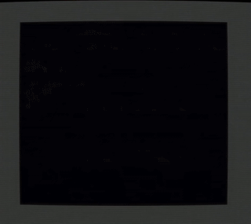

# Happy Birthday Jeff!



This is my little Commodore 64 demo for my friend Jeff's birthday on April 18th 2020.

It has been written in assembly language using the [ACME Macro Assembler](https://sourceforge.net/projects/acme-crossass/).

## Running the demo

The `.d64` disk image is available on the [release page](https://github.com/darvs/hbjf2020/releases). There are a few ways to run it.


### Vice
With the [VICE C64 Emulator](https://vice-emu.sourceforge.io/):
```
x64 -ntsc hbjf2020.d64
```

Press _Alt-Q_ to quit.

### Retroarch
With the VICE core of the [Retroarch](https://www.retroarch.com/) emulator frontend:
```
retroarch  -L /usr/local/lib/libretro/vice_x64_libretro.so $(pwd)/hbjf2020.d64
```
(Assuming your libretro cores are stored in /usr/local/lib/libretro)

Press _ESC_ twice to quit.

### MAME
With [MAME](https://www.mamedev.org/):
```
mame c64 -flop $(pwd)/hbjf2020.d64
```

With MAME the floppy won't be loaded automatically. So you'll have to type 
```
LOAD "*",8,1
```
into the emulator. The c64 `*` character might be located somewhere else on your keyboard. On mine I have to press `]` to get a `*`

And then be prepared to wait a loooooong time. That's entirely my fault, this demo is not optimized for size at all.

Once you get the `READY` prompt again, type
```
RUN
```
to start the demo.

To quit: Press the _SCROLL LOCK_ key to reactivate your keyboard, and hit the _ESC_ key to quit.


## Building

### Building on Linux

I have built this under Linux. It should be a similar process to build under MacOS or maybe even Windows with a few tweaks.

A `makefile` is included, running `make` should produce a usable `hbjf2020.d64` file in the `obj` subfolder.

In addition to `make` you will need the following tools:

[ACME Macro Assembler](https://sourceforge.net/projects/acme-crossass/)

[VICE C64 Emulator](https://vice-emu.sourceforge.io/)

ACME is the cross assembler used, it will produce a `.prg` file. The `makefile` uses `c1541` from the VICE package and builds the `.d64` from that `.prg`.

### Running your own build on Linux

The `./run` script will build the program and start it using the VICE emulator.

## Components

### Background

Background has been created in GIMP with this [Judas Priest](https://fontmeme.com/fonts/judas-priest-font/) font. 

The included `.xcf` from GIMP has been exported to a `.png` file. The 64 code is generated by [image2c64](https://pypi.org/project/c64img/) :

```
image2c64 -f hires --raw ./background.png
```

That will give us two files, a monochrome bitmap in `background_bitmap.raw` and a color map in `background_screen.raw` which we will include in our code.

### Sprites

The sprites have been created with [Spritemate](https://www.spritemate.com/), a neat online app.

Sprites were saved in `mysprites.spm` and Spritemate also exported a `sprites.a` that is immediately usable in our code.

### Preview

I recorded the output from VICE using [OBS](https://obsproject.com/download) and then generated an animated gif with ffmpeg:

```
ffmpeg -i recorded_video.mp4 -t 12 -vf "fps=30,scale=320:-1:flags=lanczos,split[s0][s1];[s0]palettegen[p];[s1][p]paletteuse" -loop 0 preview_12s.gif
```
